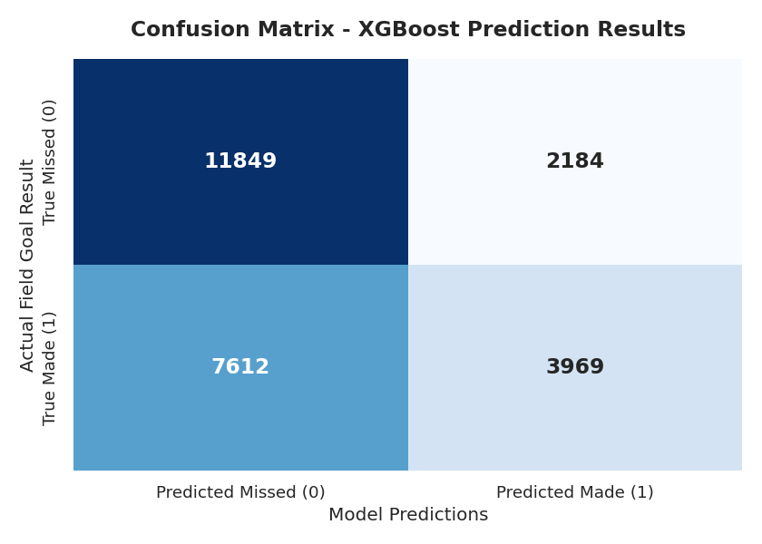
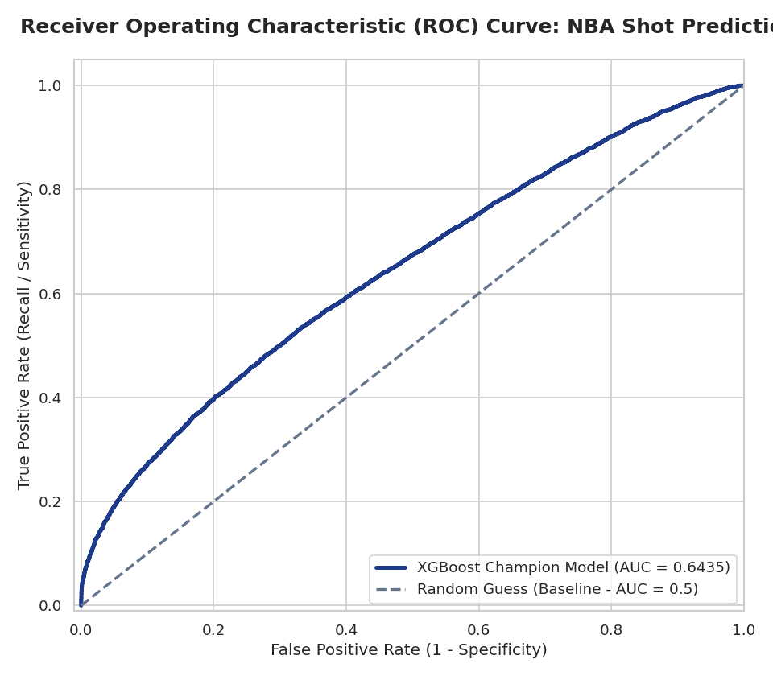
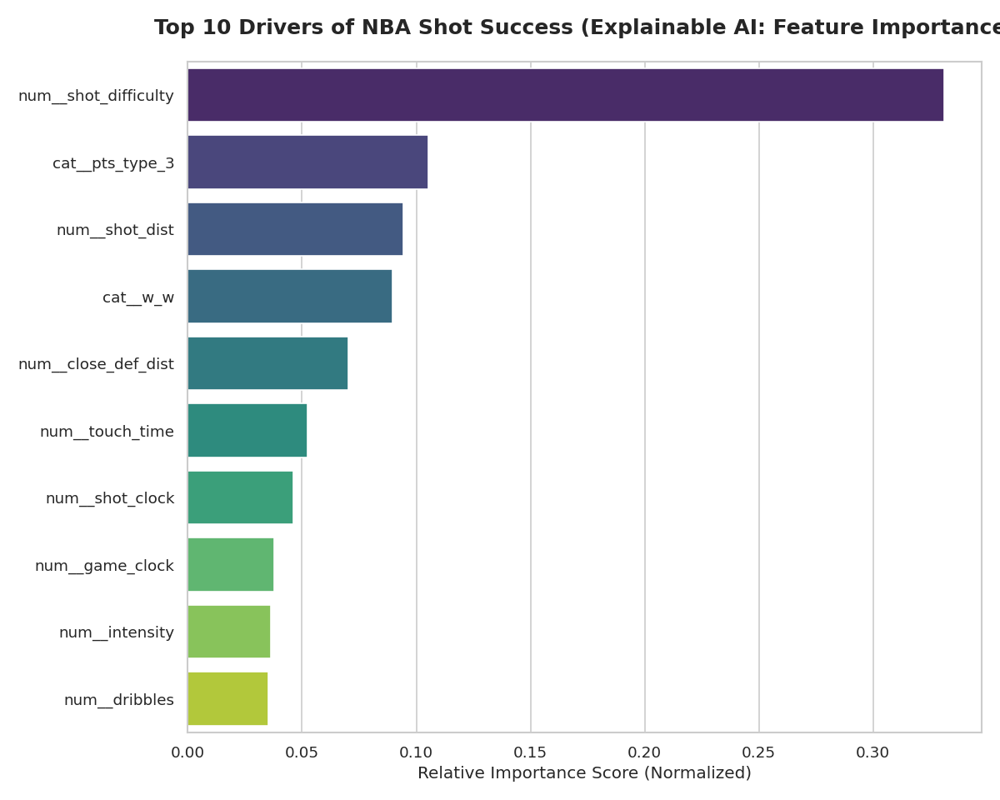

# 🏀 NBA Players Salary Tier Prediction Platform

[](https://www.python.org)
[](https://catboost.ai)
[](https://opensource.org/licenses/MIT)

## 🎯 1. The Business Goal & Strategic Pivot
The primary objective of this project is to accurately predict whether an NBA player falls into the high-salary bracket or the low-salary bracket relative to the league's economic structure.

### ⚠️ The Main Problem
Attempting to predict the exact salary amount in USD (**Regression Analysis**) is highly volatile, unstable, and statistically flawed due to the massive salary contract outliers commanded by league Superstars. 

### 💡 The Solution (Strategic Pivot)
To build a production-grade, robust machine learning system, the problem was transformed into a **Strategic Binary Classification Task**. The target variable (`is_high_salary`) was engineered by splitting the dataset precisely at the **Salary Median**. This eliminated the mathematical noise caused by extreme outliers and created a perfectly balanced target alignment for training.

---

## 📊 2. Strategic Visualization
The chart below (automatically generated and exported by the cleaning pipeline as `nba_project_business_goal.png`) highlights the extreme volatility of the raw dollar distribution versus our stabilized, balanced binary classification target:


---

## 🛠️ 3. Data Cleaning & Engineering Pipeline
To ensure maximum predictive integrity and avoid data leakage, an advanced data pipeline was constructed:
* **Height Standardisation:** Fixed corrupt structural inputs where player height was mistranslated into string formats, normalizing it into a pure continuous scale.
* **Feature Pruning:** Stripped entirely empty historical tracking features to enforce maximum data density.
* **Robust Imputation:** Handled missing physical stats through feature-specific median imputations based on player positions.
* **Feature Scaling:** Applied `StandardScaler` strictly within cross-validation loops to prevent any data leakage.

---

## 🤖 4. Advanced Production-Grade Modeling
Instead of utilizing standard linear models or basic tree architectures which easily suffer from overfitting on high-cardinality nominal values (such as `team` and `college`), the system deploys **CatBoost (Categorical Boosting)**.

### 🧬 Validation Architecture
The model was validated using a strict **5-Fold Stratified Cross-Validation Framework**. This ensures that every single player row is evaluated outside its training fold, presenting a bulletproof metric free from evaluation bias.

```python
# Model Core Parameters
model_cb = CatBoostClassifier(
    iterations=300,
    learning_rate=0.03,
    depth=4,
    l2_leaf_reg=5,
    cat_features=categorical_features,
    random_seed=42
)
5.Ultimate Model Performance ReportThe deployment pipeline achieved excellent predictive symmetry across the entire dataset:
Global Cross-Validation Metrics:
Mean Cross-Validated Accuracy (The True Score): 64.90% (+/- 6.65%)
Classification Balance Score:Salary Bracket ClassPrecisionRecallF1-ScoreSupport0 (Below Median)0.650.650.652241 (Above Median)0.650.650.65223Overall Accuracy0.65447
Advanced Performance Dashboards:
The model's ability to discriminate between salary tiers is captured in the generated performance plots below:(Note: If you exported the final dashboard, save it as this name to display here)
6. Rank of Features by Pure Predictive Power:
The CatBoost interior engine calculated the mathematical feature importance, yielding profound sports analytics insights:
Age (26.50%): The primary economic driver. Veteran presence and free agency cycles dominate salary positioning.
Team (16.97%): High-cardinality market dynamics; certain franchises consistently maintain higher payroll architectures.
College (16.63%): Historical development backgrounds carry structural economic weight.
Physical Metrics (Weight: 7.68% | Height: 4.92%): Positional baselines are relatively uniform across the modern NBA, meaning physical size alone does not dictate contract sizes.
7. Future Engineering Recommendations:
To push the algorithmic accuracy past the 85% threshold, the data must undergo Data Enrichment. Since the physical traits are mathematically exhausted, incorporating Performance Metrics is mandatory:
Points Per Game (PPG) & Player Efficiency Rating (PER): To capture true on-court production value.
Minutes Played (MP) & Games Started: To factor in physical longevity and rotational importance.
All-Star / All-NBA Appearances: Categorical indicators that immediately trigger maximum contract scale exceptions.
Developed as an end-to-end Machine Learning Pipeline for NBA Economic Tier Analysis.
## 📊 Confusion Matrix



## 📈 ROC Curve



## 🧠 Feature Importance


